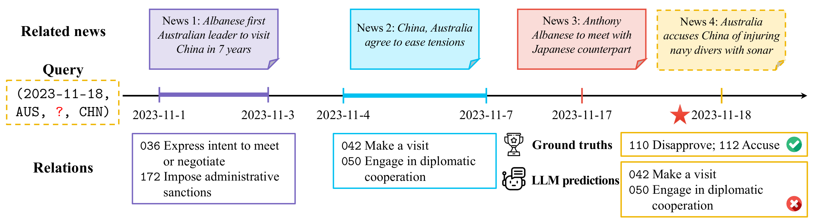
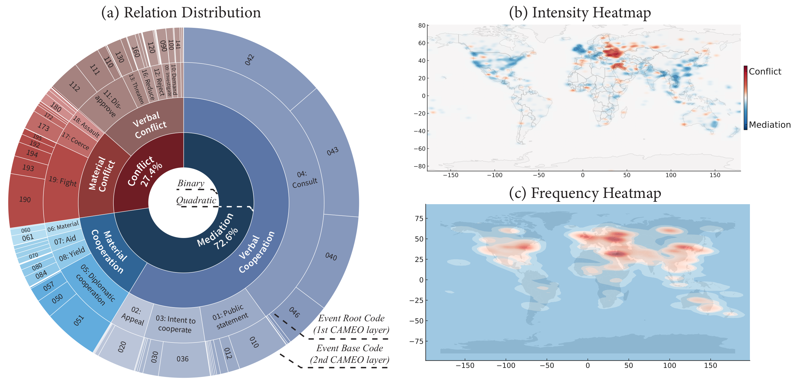
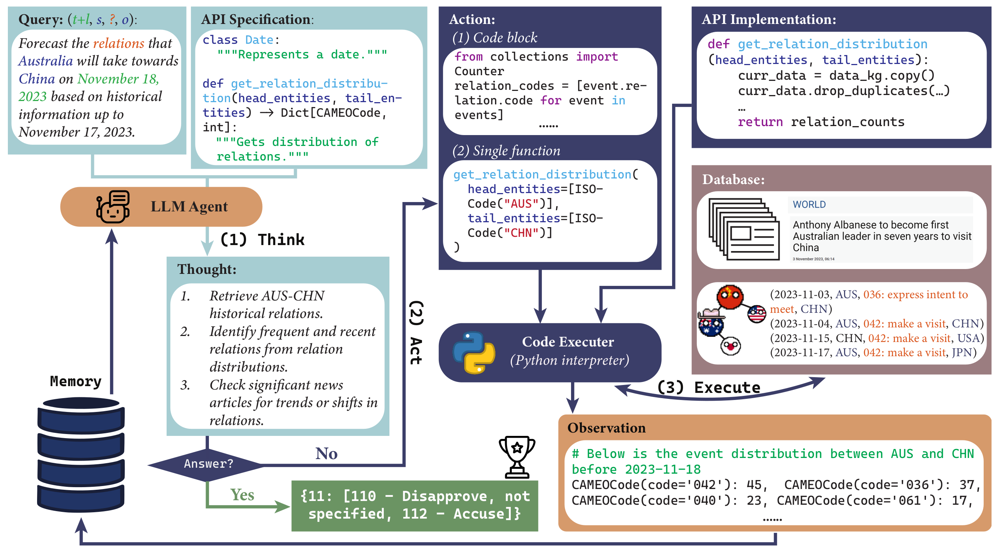
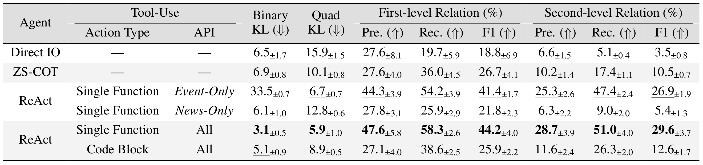
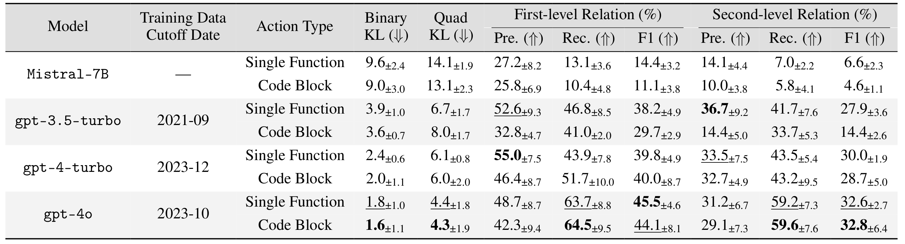
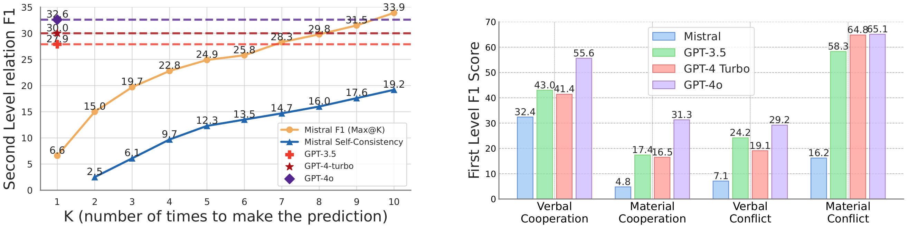
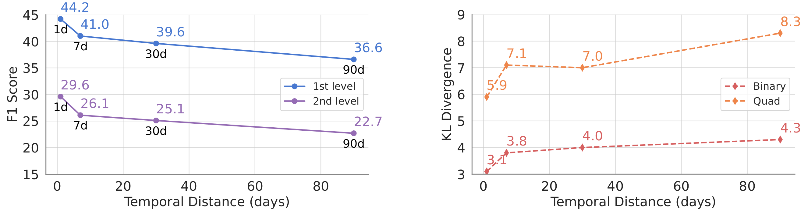
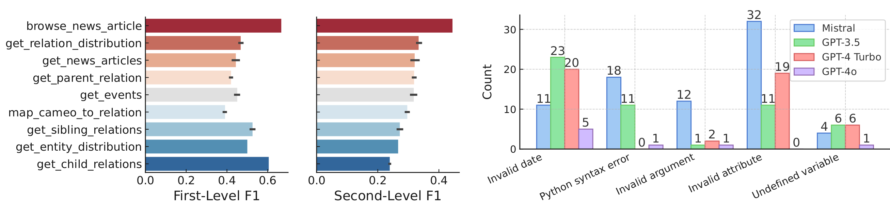
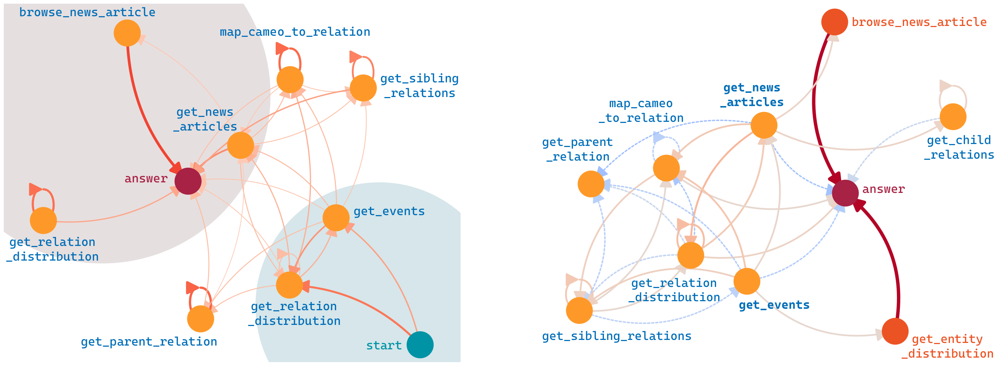
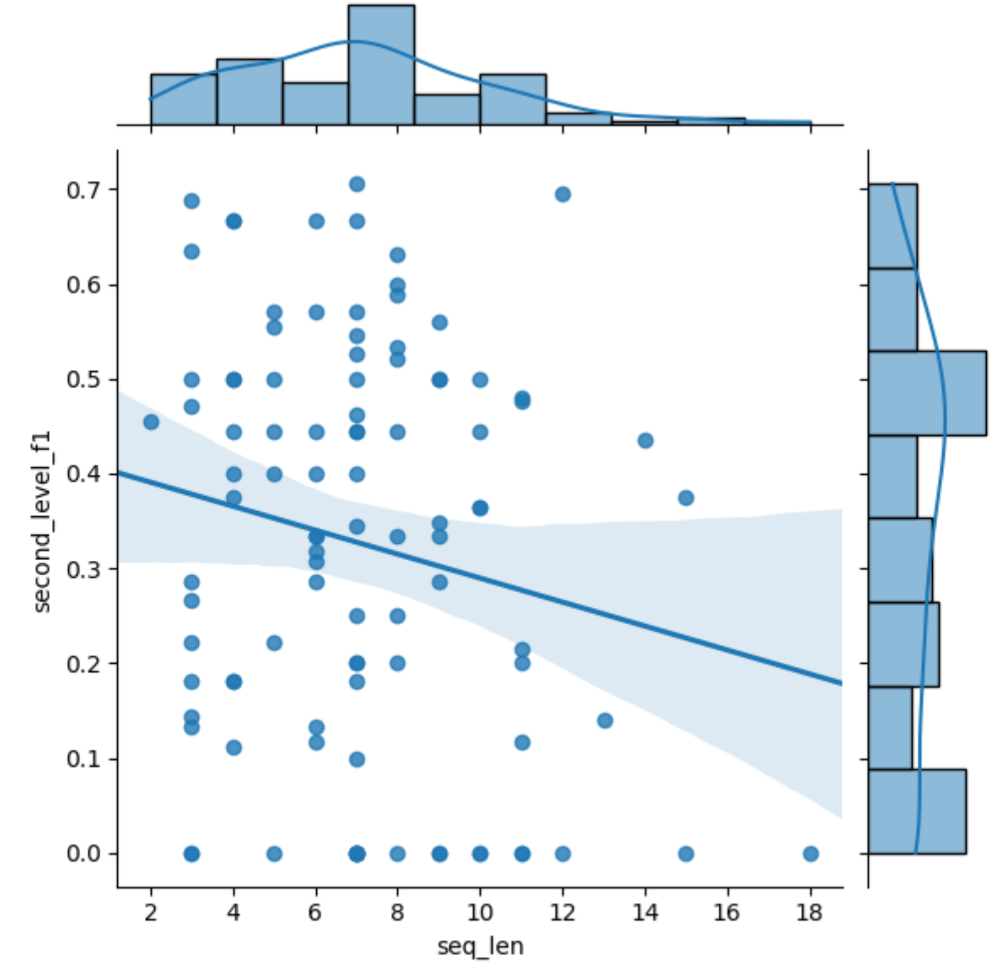

# MIRAI : Evaluating LLM Agents for Event Forecasting

This repository contains the code and data for the paper "**MIRAI: Evaluating LLM Agents for Event Forecasting**".

Authors (*Equal Contribution): [Chenchen Ye](https://yecchen.github.io/)\*, [Ziniu Hu](https://acbull.github.io/)\*, [Yihe Deng](https://sites.google.com/g.ucla.edu/yihedeng/)\*, [Zijie Huang](https://zijieh.github.io/), [Mingyu Derek Ma](https://derek.ma/), [Yanqiao Zhu](https://sxkdz.github.io/), [Wei Wang](https://web.cs.ucla.edu/~weiwang/).

[](https://mirai-llm.github.io/)
[](https://drive.google.com/file/d/1xmSEHZ_wqtBu1AwLpJ8wCDYmT-jRpfrN/view?usp=sharing)
[](https://colab.research.google.com/drive/1QyqT35n6NbtPaNtqQ6A7ILG_GMeRgdnO?usp=sharing)
[](https://colab.research.google.com/drive/1QyqT35n6NbtPaNtqQ6A7ILG_GMeRgdnO?usp=sharing)


https://github.com/yecchen/MIRAI/assets/109169855/f2c44af4-b2e1-4b5f-bc2a-e0ac6a74e58a


## Table of Contents
- [About MIRAI](#About-MIRAI)
- [Demos and Examples](#Demos-and-Examples)
- [Setup](#Setup)
    - [Environment](#Environment)
    - [Data](#Data)
- [Dataset Construction](#Dataset-Construction)
- [Getting Started](#Getting-Started)
    - [Setting Arguments](#Setting-Arguments)
    - [Forecasting with Different Agent Methods and Tool-Use Strategies](#Test-Forecasting-with-Different-Agent-Methods-and-Tool-Use-Strategies)
      - [Direct IO](#Direct-IO)
      - [ZS-COT](#ZS-COT)
      - [ReAct](#ReAct)
    - [Forecasting with Different Base LLMs](#Forecasting-with-Different-Base-LLMs)
    - [Forecasting with Different Temporal Distances](#Forecasting-with-Different-Temporal-Distances)
    - [Evaluation](#Evaluation)
    - [Further Analysis](#Further-Analysis)
- [Acknowledgement](#Acknowledgement)
- [Statements](#Statements)


## About MIRAI
We introduce **MIRAI**, a benchmark crafted for evaluating LLM agents for temporal forecasting in the realm of international events, with tool-use and complex reasoning. We consider *forecasting* as the process of collecting essential historical data and performing temporal reasoning to anticipate the outcomes of future events.

Our benchmark features an agentic environment with tools for accessing an extensive database of historical, structured events and textual news articles. We refine the [GDELT](https://www.gdeltproject.org) event database with careful cleaning and parsing to curate a series of relational prediction tasks with varying forecasting horizons, assessing LLM agents’ abilities from short-term to long-term forecasting.

We further implement APIs to enable LLM agents to utilize different tools via a code-based interface. In summary, MIRAI comprehensively evaluates the agents’ capabilities in three dimensions: 1) autonomously source and integrate critical information from large global databases; 2) write codes using domain-specific APIs and libraries for tool-use; and 3) jointly reason over historical knowledge from diverse formats and time to accurately predict future events. Through comprehensive benchmarking, we aim to establish a reliable framework for assessing the capabilities of LLM agents in forecasting international events, thereby contributing to the development of more accurate and trustworthy models for international relation analysis.

<p align="center">
     <br>
  Task Figure: An example of forecasting the relations between Australia and China on Nov.18.2023. The database contains query-related historical relations and news articles, while the agent fails to predict the change of relation and makes a wrong forecast.
</p>


<p align="center">
     <br>
  Database Figure: MIRAI comprehensively covers global event data. (a) The circular chart shows the relation hierarchy and distribution in MIRAI. (b) The heatmap visualizes the intensity of these events globally, distinguishing between areas of conflict (red) and mediation (blue). (c) The heatmap illustrates the frequency of these events, highlighting regions with the most occurrences.
</p>

<p align="center">
     <br>
  Agent Figure: Overview of the LLM agent’s interaction with the multi-source environment in MIRAI using the ReAct strategy for forecasting a query event. The framework consists of three main steps: (1) Think: The agent analyzes the current status and plans the next action based on the query and the provided API specifications. (2) Act: The agent generates a Single Function call or a Code Block to retrieve and analyze relevant data from the database. (3) Execute: The Python interpreter runs the generated code with the API implementation and database and produces observations. These steps are iteratively performed until the agent reaches a final forecast for the future relation.
</p>

## Demos and Examples
We provide example reasoning and forecasting outputs of the agent. The examples are performed by the GPT-4o based agent with the ReAct strategy and action type as Code Block / Single Function. The raw outputs are stored in `examples/outputs_raw` and the markdown formatted outputs are stored in `examples/outputs_md` [here](examples/outputs_md).

We also provide a Google colab notebook for running the example forecasting with the GPT-4o based agent. The interactive demo notebook is available [here](https://colab.research.google.com/drive/1QyqT35n6NbtPaNtqQ6A7ILG_GMeRgdnO?usp=sharing).

## Setup
### Environment
The following steps provide the necessary environment setup.
1. Create a Python virtual environment with Conda:
```
conda create -n mirai python=3.9
conda activate mirai
```
2. Install the following Python dependencies to run the codes.
```
pip install -r requirements.txt
pip install flash-attn --no-build-isolation
```
3. Set up necessary environment variables.
```
export OPENAI_API_KEY="your_openai_api_key"
huggingface-cli login --token "${your_access_token}"
```

### Data
Download the data from the following link: [MIRAI Data](https://drive.google.com/file/d/1xmSEHZ_wqtBu1AwLpJ8wCDYmT-jRpfrN/view?usp=sharing) and extract the contents to the `data` directory.

## Dataset Construction
To construct the above data from scratch,  we also provide the detailed scripts for dataset construction. The dataset construction scripts is contained in the `dataset_construction` directory, including the following files and running commands:
```python
cd dataset_construction
```
1. `1_download_kg_data.py`: Download the GDELT raw data from the official website.
```python
python 1_download_kg_data.py
```
2. `2_clean_kg.py`: Clean the raw data and standardize the event data.
```python
python 2_clean_kg.py
```
3. `3_filter_kg_by_source.py`: Filter the event data by the source news articles, especially the number of daily mentions.
```python
python 3_filter_kg_by_source.py
```
4. `4_distribute_download_text.py`: Download source news articles for each event.
```python
python distribute_download_text.py --hosts "host1,host2" --username "your_username" --password "your_password" \
    --project_dir "/remote/project/directory" --conda_path "/remote/conda/path" --env_name "remote_conda_environment" \
    --script_path "/remote/script/path.py" --output_directory "/path/to/output" --log_directory "/path/to/logs"
```
5. `5_clean_text.py`: Clean the downloaded news articles. We follow part of the web document cleaning process from [OBELICS](https://github.com/huggingface/OBELICS). In this process, we use the SentencePiece tokenizer model and the FastText lang id model, [lid.176.bin](https://fasttext.cc/docs/en/language-identification.html), which needs to be downloaded and placed in the `obelics/models` directory.
```python
python 5_clean_text.py
```
6. `6_generate_final_data.py`: Generate the final dataset for MIRAI, including data_kg.csv and data_news.csv.
```python
python 6_generate_final_data.py
```
7. `7_generate_test_set.py`: Generate the test set for MIRAI, which is built on the November 2023 data from the final dataset.
```python
python 7_generate_test_set.py
```
8. `8_generate_test_subset.py`: Generate the test subset for MIRAI, which samples a balanced subset from the test set.
```python
python 8_generate_test_subset.py
```
9. `9_generate_relation_query.py`: Generate the relation query for MIRAI, which is used for agent forecasting and evaluation.
```python
python 9_generate_relation_query.py --dataset test
python 9_generate_relation_query.py --dataset test_subset
```

## Getting Started

```python
cd agents
```

### Setting Arguments
The following arguments are used for running the code scripts `react_agent.py` and `direct_agent.py`:
- `--dataset`: Selects the dataset to be used. Available options are:
  - `test`: Full test dataset.
  - `test_subset`: A balanced subset of the test dataset.
  Default is `test_subset`.
- `--timediff`: Specifies the date difference from the query date to the current date, which is the temporal distance of the forecasting target. This is an integer value with a default of 1.
- `--model_name`: Chooses the model for execution. Options include:
  - `gpt-3.5-turbo-0125`: Latest GPT-3.5 turbo model (as of September 2021).
  - `gpt-4-turbo-2024-04-09`: Latest GPT-4 turbo model (as of April 2024).
  - `gpt-4o-2024-05-13`: Most advanced GPT-4o model (as of October 2023).
  - `Mistral-7B-Instruct-v0.2`: Mistral 7B model (release date unknown).
  Default is `gpt-3.5-turbo-0125`.
- `--temperature`: Sets the temperature of the model, influencing the randomness of the output. Default is 0.4.
- `--rounds`: Defines the number of rounds for each query to be executed. This is an integer value with a default of 1.
- `--plan`: Specifies the agent planning strategy. For `react_agent.py`, the only available option is `react`; For `direct_agent.py`, the available options are `direct` and `cot`:
  - `react`: ReAct strategy.
  - `direct`: Direct IO strategy.
  - `cot`: Zero-Shot Chain-of-Thought (ZS-CoT) strategy.
- `--action`: Determines the type of action to be performed by the agent. For `react_agent.py`, the available options are `func` and `block`; For `direct_agent.py`, the only option is `none`:
  - `func`: Each agent action is a single function call.
  - `block`: Each agent action is a code block.
  - `none`: No action is performed.  
  Default is `func` for `react_agent.py` and `none` for `direct_agent.py`.
- `--api`: Selects the API type to be used. For `react_agent.py`, the available options are `full`, `kg`, and `news`; For `direct_agent.py`, the only option is `none`:
  - `full`: Full API access.
  - `kg`: Only access to the Event-related APIs.
  - `news`: Only access to the News-related APIs.
  - `none`: No API access.  
  Default is `full` for `react_agent.py` and `none` for `direct_agent.py`.
- `--max_steps`: Sets the maximum number of action steps. Default is 20 for `react_agent.py` and 0 for `direct_agent.py`.
- `--output_dir`: Path to the directory where output files will be stored. Default is `./../output`.
- `--data_dir`: Path to the directory containing the data files. Default is `./../data/MIRAI`.
- `--api_dir`: Path to the directory containing API descriptions. Default is `./../APIs/api_description_full.py`.
- `--alias`: Sets an alias for the output file. This is an optional field and is empty by default.

To run the script with default settings, simply execute it from your command line. To customize the settings, provide the appropriate argument values when you execute the script.


### Test Forecasting with Different Agent Methods and Tool-Use Strategies
<p align="center">
  Experimental results on the test set with different agent tools and the tool-use strategies.
   <br>
</p>
We provide the code for testing the forecasting performance of different agent methods and tool-use strategies:

#### Direct IO
In the Direct IO setting, the LLM directly provides answers without tool-use or explicit reasoning:
```python
python direct_agents.py --dataset test --model gpt-3.5-turbo-0125 --plan direct
```

#### ZS-COT
In the Zero-Shot Chain-of-Thought (ZS-CoT) setting, an instruction
prompt is added to encourage the LLM to explicit step-by-step thinking before making the final prediction:
```python
python direct_agents.py --dataset test --model gpt-3.5-turbo-0125 --plan cot
```

#### ReAct
In the ReAct setting, the LLM interacts with the environment using the ReAct strategy, which includes iterative process of thinking, acting, and observing.  
For example, to test the ReAct strategy with the Code Block action type and the All APIs:
```python
python react_agents.py --dataset test --model gpt-3.5-turbo-0125 --action block --api full
```


### Forecasting with Different Base LLMs
<p align="center">
    Experimental results on the test subset using different base LLMs and action types.
     <br>
</p>

We provide the code for testing the forecasting performance of different base LLMs.  
For example, to test the forecasting performance of the GPT-4o model with the Code Block action type:
```python
python react_agents.py --dataset test_subset --action block --model gpt-4o-2024-05-13
```

Another example, to test the forecasting performance of the Mistral 7B model with the Single Function action type, but with multiple rounds of 10:
```python
python react_agents.py --dataset test_subset --action func --model Mistral-7B-Instruct-v0.2 --rounds 10
```

<p align="center">
     <br>
  Experiment results show that a) Self-consistency of Mistral-7B model increases with more samples. b) F1 scores of different base LLM agents on relation prediction, categorized based on the quadratic classes.
</p>


### Forecasting with Different Temporal Distances
<p align="center">
     <br>
  Evaluation of LLM Agents in different temporal distances of the forecasting event.
</p>

We provide the code for testing the forecasting performance of different temporal distances.  
For example, to test the forecasting performance of the GPT-4o model with a temporal distance of 30 days:
```python
python react_agents.py --dataset test --model gpt-4o-2024-05-13 --timediff 30
```


### Evaluation
We provide script `agent_evaluation/eval.py` for evaluating the forecasting performance of the LLM agents. It has the same arguments as the `react_agent.py` and `direct_agent.py` scripts, with the additional argument `--output_eval_dir` to specify the directory where the evaluation results will be stored, the default is `./output_eval`.  
For example, to evaluate the forecasting performance of the GPT-4o model with the Code Block action type and the All APIs:
```python
python agent_evaluation/eval.py --dataset test --model gpt-4o-2024-05-13 --action block --api full
```

### Further Analysis

<p align="center">
     <br>
  a) Average F1 scores when the agent using each API function. b) Code execution error analysis for different LLMs.
</p>

<p align="center">
     <br>
  Action order analysis in LLM agents. a) Tool-Use Transition Graph of called API functions. Edge thickness indicates transition frequency. b) Freq.(correct) - Freq.(incorrect), in which red (blue) edges indicate positive (negative) contributions.
</p>

<p align="center">
     <br>
  Correlation of F1 Accuracy to Action Sequence Length.
</p>


## Acknowledgement
We thank the following projects for providing the useful database and codebase for our research:
- [GDELT](https://www.gdeltproject.org)
- [OBELICS](https://github.com/huggingface/OBELICS)
- [FastText](https://github.com/facebookresearch/fastText)
- [SentencePiece](https://github.com/google/sentencepiece)


## Statements
The code and data in this repository are for research purposes only. The data is derived from the GDELT project, and the authors have followed strict guidelines to ensure the data is used in compliance with the GDELT terms of service. Based on https://www.gdeltproject.org/about.html#termsofuse , GDELT dataset *“is an open platform for research and analysis of global society and thus all datasets released by the GDELT Project are available for unlimited and unrestricted use for any academic, commercial, or governmental use of any kind without fee.”, as long as “any use or redistribution of the data must include a citation to the GDELT Project and a link to this website ( https://www.gdeltproject.org/ ).”*, which the authors have cited in the paper and this GitHub repository. The authors have also followed the guidelines for data usage and citation as per the GDELT terms of service. The authors bear all responsibilities in case of violation of any terms of service.
